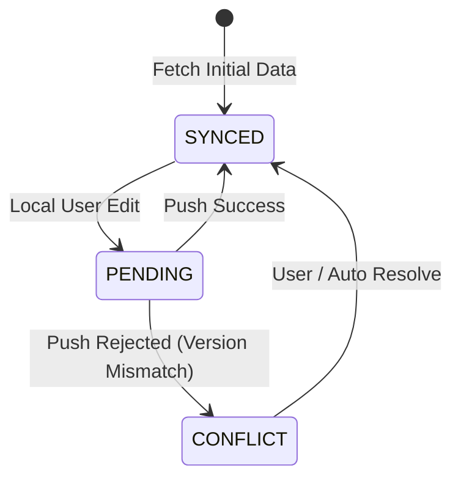

# Double-Entry Ledger & Sync Engine Architecture
**Project:** `com.safa.account`

This document defines the core financial data model, enforcing a strict double-entry ledger invariant, coupled with a highly scalable offline-first sync engine.

## 1. Double-Entry Accounting Schema
Every transaction consists of at least two entries: a debit and a credit. The fundamental equation must always hold: `Total Debits = Total Credits`.

### Transaction & Entry Schema
```sql
CREATE TABLE accounts (
    id UUID PRIMARY KEY,
    tenant_id UUID NOT NULL,
    name VARCHAR(255) NOT NULL,
    type VARCHAR(50) CHECK (type IN ('asset', 'liability', 'equity', 'revenue', 'expense')),
    currency VARCHAR(3) NOT NULL,
    created_at TIMESTAMP DEFAULT CURRENT_TIMESTAMP
);

CREATE TABLE transactions (
    id UUID PRIMARY KEY,
    tenant_id UUID NOT NULL,
    description TEXT,
    transaction_date TIMESTAMP NOT NULL,
    status VARCHAR(20) DEFAULT 'posted',
    hash_prev VARCHAR(64), -- For Tamper-evident ledger
    hash_current VARCHAR(64),
    created_at TIMESTAMP DEFAULT CURRENT_TIMESTAMP
);

CREATE TABLE journal_entries (
    id UUID PRIMARY KEY,
    transaction_id UUID REFERENCES transactions(id),
    account_id UUID REFERENCES accounts(id),
    amount DECIMAL(19, 4) NOT NULL, -- Positive for debit, Negative for credit
    created_at TIMESTAMP DEFAULT CURRENT_TIMESTAMP
);
-- Constraint: SUM(amount) for a given transaction_id must equal 0
```

## 2. Sync Engine Architecture (Offline-First)
The app uses a local database (Room) and synchronizes with the Laravel backend via a robust vector-clock or Last-Write-Wins (LWW) resolution engine.

### Conflict Resolution Strategy
Each record maintains a `logical_clock` (vector clock) or `updated_at` (LWW) and a `sync_status` (`PENDING`, `SYNCED`, `CONFLICT`).

1. **Local Writes:** Update local DB, increment local clock/timestamp, mark `sync_status = PENDING`.
2. **Push:** Push `PENDING` records to backend.
3. **Backend Validation:** Backend checks timestamps. If backend > client, it rejects the push and sends a conflict. If client > backend, it accepts.
4. **Pull:** Fetch records modified since `last_sync_timestamp`.

### State Machine


## 3. Cryptographic Ledger (Tamper-Evidence)
To provide non-repudiation and auditability, transactions are linked via SHA-256 hashes, forming a blockchain-like structure per tenant.

```kotlin
fun calculateTransactionHash(tx: Transaction, prevHash: String): String {
    val payload = "${tx.id}|${tx.date}|${tx.amount}|${prevHash}"
    val bytes = MessageDigest.getInstance("SHA-256").digest(payload.toByteArray())
    return bytes.joinToString("") { "%02x".format(it) }
}
```
If an auditor re-calculates the hashes and finds a mismatch, it indicates database tampering.
